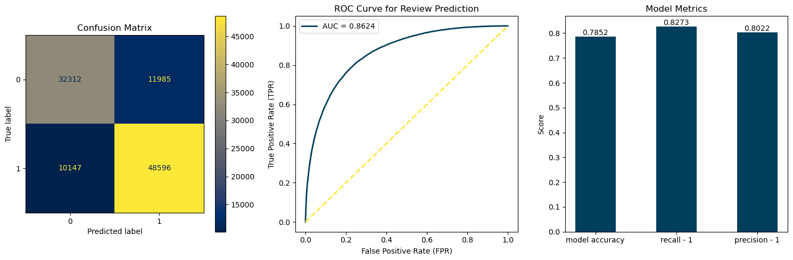

NLP Hotel reviews - in this BrainStation Bootcamp project, several algorithms were built and compared for their performance in analysing hotel reviews.

The best model is a logistic regression with the following parameters:

The best model is a logistic regression, with l2-penalty and a cossfunction weighting of C= 0.1. The model achieves an accuracy of 78.91% when applied to the test data in predicting a positive overall assessment of the reviewer. The model has an AUC of 0.863, indicating that the classifier performs well and can correctly distinguish between positive and negative reviews in 86.3% of cases. This means that there is a high probability that a randomly selected positive case will receive a higher score than a randomly selected negative case. The closer the AUC is to 1, the better the discriminatory ability of the model. This can also be seen in the Confusion Matrix. 

The precision, i.e. the correct classification of a positive review, is 80.20%. This means that 80% of the test data classified as positive in the overall assessment was a genuinely positive overall assessment. The recall rate indicates how many of all positive overall assessments from the test data set were correctly classified by the model. This is 82.73%. 

The complete notebook can be found here: 

[NLP_hotel_review](/BM_NLP_hotel_review.ipynb)