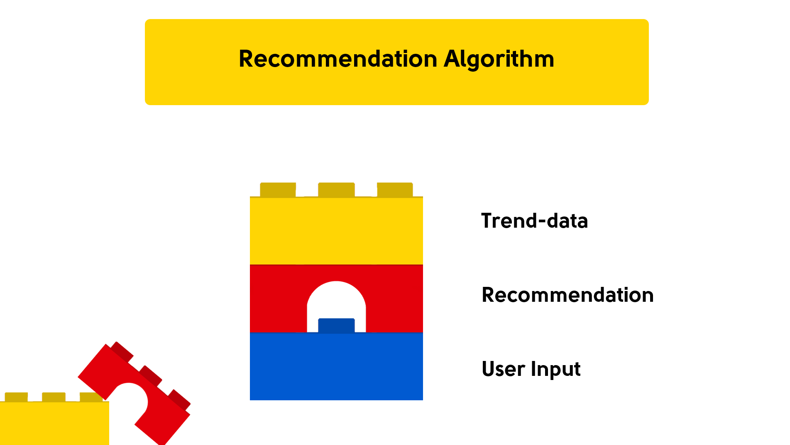
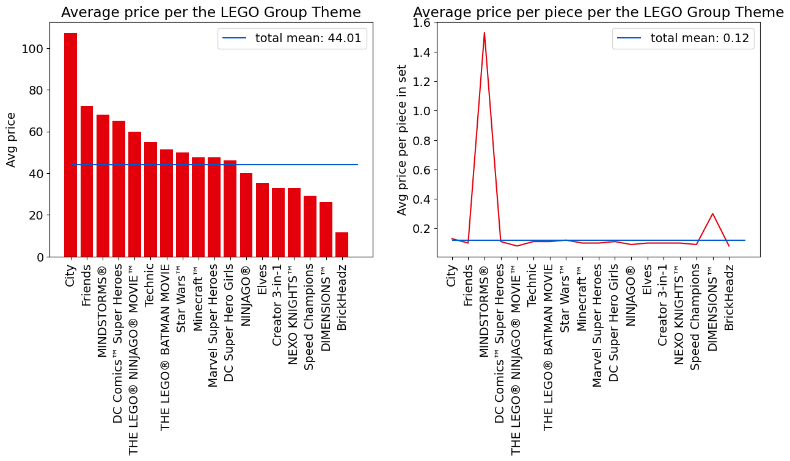
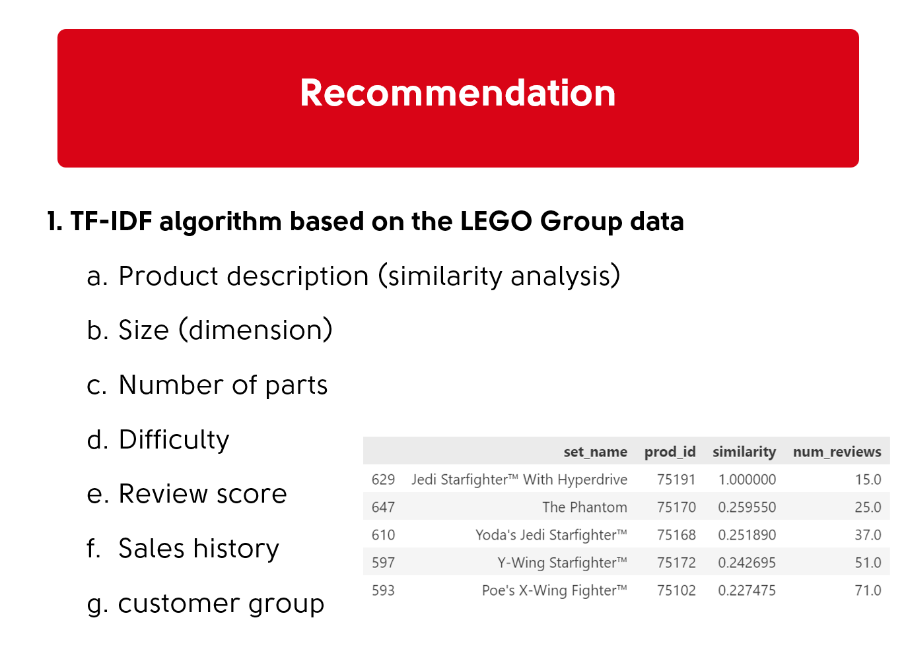
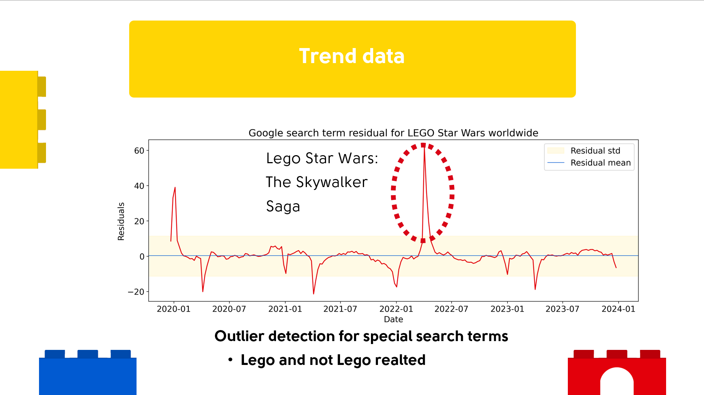

# 24h Hackaton by Brainstation & The LEGO Group - 27-28 of June 2024
## TEAM LEt's GO 
====================================================================

Team members: 
[Franco Bertogg (UX Design)](https://www.linkedin.com/in/franco-bertogg-gallardo/),
[Temi Adenuga (Software Engineering)](https://www.linkedin.com/in/temi-adenuga/) &
[Benedikt Middelstaedt (me)(Data Science)](https://www.linkedin.com/in/benedikt-middelstaedt/)

Link to the App Design:
https://legoapp.netlify.app/

### Problem Space:

When selecting a gift for a child, adults often struggle finding the right choice to please young ones. This is due to the rapidly changing preferences of children and the endless options for toys and products available on the market.

Making a choice requires considering factors such as the child’s age, interests, and developmental stage. Additionally, adults need to find the balance between educational value and entertainment, ensuring the gift is both enjoyable and beneficial for the child’s growth. Lastly, occasions such as birthdays and Christmas create high-pressure situations where the expectations for finding the perfect gift are elevated.

### Problem Statement:
 How might we assist adults in selecting the right gift for a kid’s birthday?

The analysis is based on the following datasets: 

https://www.kaggle.com/datasets/mterzolo/lego-sets

https://www.kaggle.com/datasets/PromptCloudHQ/toy-products-on-amazon/code

The Git repository mainly deals with the data science perspective of the hackathon. However, the overall result with which we were able to assert ourselves as the winning team is a team result. 

The current LEGO Company gift finder has some problem areas that are
systematically addressed.

The following approaches are taken into account:

- Functionality and user group do not match.

- Some combination options lead to 0 gift suggestions
- Some combination options lead to gift suggestions outside the age restrictions
- Price limit filter is too hard and does not allow for small deviations

- TEAM approach:
    - Create an application that awakens longing in the child and leads to the parent buying a product because they can be persuaded

- Data Science solution:
[Link to the slides](LEtsGO_presentation.pdf)

Recommendation algorithm:
1. User inputs
    - Location
    - Age of the customer
    - Interests
    - Activities
    - Previous order
2. Recommendation
    - Age of the buyer
    - What others are buying
    - Number of parts
    - Difficulty
    - Customer groups
    - Size
    - Price

Example of prices per age cluster

3. Trend
    - Trend analysis
    - Search patterns
    - the LEGO Group specific search patterns
    - the LEGO Group non-specific search patterns
    - Price sensitivity analyses of the user group
    - Price frustration limit

The goal is to let the child choose a product and then make suggestions to the parent based on the selection
It is not intended to filter prices by To establish this from the beginning.

The following thoughts:

If a parent sets a price limit for a gift in their head. If this is set as a filter before
the selection, it is fixed. Assuming this limit is X= $40 - if the child now decides on a product category,
the algorithm must be so good that suitable products with the price X+y are now displayed. y is customer-specific and on the one hand must not be too high and
thus lead to the purchase process being aborted, but user-specific should increase the maximum X by an amount. This y is planned as an increase in sales. In addition, a section should be introduced that offers cheaper alternatives in the search results in order to at least achieve this sales.
The main goal of the algorithm is for the customer to complete the purchase.

## Overview

This repository contains two Jupyter notebooks that form the basis of a data processing and recommendation system. The notebooks are designed to load, preprocess, and generate recommendations based on a given dataset. The system is split into two primary components:

1. **Data Loading and Preprocessing**: `01_Data_loading.ipynb`
2. **Recommendation System**: `02_recommender.ipynb`

## Notebooks Description

[01_Data_loading.ipynb](/01_Data_loading.ipynb)

This notebook handles the initial data loading and preprocessing tasks. It includes the following steps:

- **Data Import**: Loading data from various sources (e.g., CSV files, databases) into the notebook.
- **Data Cleaning**: Handling missing values, removing duplicates, and performing other cleaning tasks to ensure the data is ready for analysis.
- **Data Transformation**: Transforming the data into a suitable format for the recommendation system. This might include normalization, encoding categorical variables, and feature extraction.
- **Exploratory Data Analysis (EDA)**: Basic statistical analysis and visualizations to understand the data distribution and relationships between variables.

[02_recommender.ipynb](/02_recommender.ipynb)

This notebook focuses on building and evaluating a recommendation system (JUST FEASABILITY) It includes the following steps:

- **Model Training**: Training the selected model on the preprocessed data.
- **Prediction**: Generating recommendations for users or items based on the trained model.

## Requirements

To run these notebooks, you will need the following Python packages:

- `pandas`
- `numpy`
- `scikit-learn`
- `matplotlib`
- `seaborn`
- `jupyter`

the notebooks use the data folder as a source of the data and expecting this folder in ../data/DATA

## Feedback from the jury (partial)

- It was a comprehensive analysis. An excellent piece of work that was done within a day. I looked at the notebook, and it clearly shows your skills and ability to drive insights from a simple database.
Albeit the team had a smaller number of members in comparison, it seems that collaboration was outstandingly effective, which resulted in a complete and integrated project on all disciplines.
Could clearly see them engaged and enjoying the moment, great job!
- I could clearly see the team work and collaboration across different discipline.Fantastic job!

- The work you've conducted in such a short span of time is fantastic, and I encourage you to include it in your portfolios. The presentation was not short of containing industry-level best practices, and the team impressed us with their storytelling, data analysis, and demo showcase.
